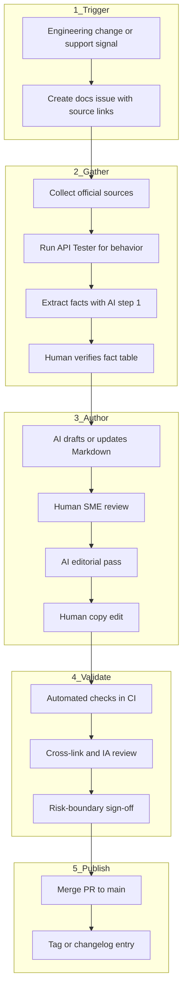

# End-to-end documentation lifecycle

This document describes the complete pipeline from a product change to published documentation. It applies to any API topic in this repository. The [AI-assisted drafting loop](./ai-assisted-docs-workflow.md) covers how individual pages are written. This document covers everything before and after that loop.

## Pipeline overview

## Stage 1: Trigger and intake

Documentation work starts from a tracked signal or a stakeholder.

### Common triggers

| Trigger | Example for merge API | Who is responsible for communication |
|---|---|---|
| Roadmap change comms | New profile attribute will be added in Q426 | Engineering or Product team | 
| API reference change | New profile attribute added to `/v1/pdf/merge` | Engineering team |
| Pricing or credits change | Credit rate updated on pricing page | Product manager or Revenue team |
| Support or community pattern | Increase in "merge fails with comma-separated URLs" tickets | Support team or automated dashboard alert |
| Scheduled review | Quarterly audit of external links and examples | Technical writer |

### Issue template (minimum fields)

Before starting any work, create an issue in a tracking tool (such as Jira) to ensure accurate workload awareness. Every docs-related issue should include:

- **Change summary:** What changed in the product or source material.
- **Source links:** API reference URL, API Tester result, pricing page, or ticket link.
- **Affected pages:** Which files may need updates.
- **Reader impact:** Who is affected (i.e., users in specific plans, all users).
- **Risk level:** Low (wording), medium (behavior or examples), high (pricing, security, retention).

No drafting begins until the issue exists. This creates an auditable record for reviewers and future maintainers.

## Stage 2: Gather and verify information

The goal of this stage is to perform a **human-verified fact table** before any documentation is created or updated.

### Sources for this assignment

1. [PDF.co merge API reference](https://developer.pdf.co/api/merge/pdf)
2. [PDF.co API Tester](https://developer.pdf.co/api-tester/merge/pdf)
3. [PDF.co credit pricing](https://app.pdf.co/subscriptions/credits_pricing)
4. [PDF.co response codes](https://developer.pdf.co/api/response-codes)

If sources conflict, the issue is blocked until a human verifies behavior in the API Tester or with the product owner. AI does not resolve conflicts, only highlights them.

### Information gathering steps

1. Read the linked source change (API diff, pricing page, ticket thread).
2. Run the affected request in the API Tester and save request/response.
3. Run AI **fact extraction** (see [AI workflow, step 2](./ai-assisted-docs-workflow.md#a-practical-drafting-loop)).
4. Compare the extracted table to live sources line by line.
5. Attach the verified fact table to the issue.

**Output of this stage:** verified fact table attached to the issue, ready for drafting. 

## Stage 3: Create or update files

Reader-facing content lives in topic folders (for example, `pdfco-merge/`). Reusable process documentation lives in `process/` at the repository root and applies across endpoints.

### File creation rules (PDF.co merge sample)

| Page type | File naming | When to create vs update |
|---|---|---|
| Tutorial | `pdfco-merge/merge-pdfs.md` | Update in place unless scope splits into a new task |
| Reference | `pdfco-merge/merge-reference.md` | Update tables. Avoid duplicating narrative in other pages. |
| Explanation | `pdfco-merge/credits.md` | Update when pricing model or monitoring guidance changes |
| Troubleshooting | `pdfco-merge/troubleshooting.md` | Add symptom sections when new failure patterns appear |

### Authoring steps

1. Define the reader outcome in one sentence (issue or PR description).
2. Run AI **constrained draft** using only the verified fact table ([AI workflow, step 3](./ai-assisted-docs-workflow.md#a-practical-drafting-loop)).
3. **Human SME review:** Verify endpoints, fields, defaults, limits, and examples against API Tester.
4. Run AI **editorial review** against the style guide ([AI workflow, step 4](./ai-assisted-docs-workflow.md), formalized in component 4).
5. **Human copy edit:** Accept or reject editorial suggestions. The writer owns the publish decision.

### Pull request requirements

- Links the docs issue.
- Lists affected files.
- Notes which sources were checked.
- Includes before/after summary for non-trivial changes.

## Stage 4: Validate

Validation combines automated checks (objective) with human gates (judgment).

### Automated checks (CI)

Run on every PR touching reader-facing content (for example, `pdfco-merge/`):

| Check | What it catches |
|---|---|
| Markdown lint | Broken formatting, missing language tags on code fences |
| Front matter schema | Missing `title`, `type`, `audience`, or `status` |
| Link check | Broken internal links and unreachable external URLs |
| Secret scan | API keys, passwords, or tokens in examples |
| Field name lint | Request/response field names that do not appear in the verified fact table |
| Illustrative rate label | Credit examples missing "illustrative" or link to live pricing |

These checks catch drift and accidental exposure. They do not judge clarity or correctness of explanations.

### Human quality gates

| Gate | Reviewer | Required for |
|---|---|---|
| **SME fact-check** | Writer or engineer with API access | Every PR |
| **Cross-link check** | Writer | Every PR: New fields appear in reference and relevant how-to/troubleshooting |
| **IA check** | Writer | New pages or structural changes: Correct Diátaxis type |
| **Risk-boundary sign-off** | Writer or product owner | High-risk changes (pricing, security, retention, retry advice) |

## Stage 5: Publish

Publishing means merging to the default branch. For this sample, the GitHub repository **is** the published artifact. In production, merge to `main` would also trigger a static site build (Mintlify, Starlight, etc.).

### Publish steps

1. All CI checks pass.
2. Required human gates signed off in the PR.
3. Merge PR to `main`.
4. Add a brief changelog entry or release note for user-visible changes.
5. Close the linked docs issue with a pointer to the merged PR.

## Definition of Done

A documentation change is **done** when all of the following are true:

- [ ] A tracked issue exists with source links and affected pages listed.
- [ ] Facts were verified against official sources or API Tester before drafting.
- [ ] All links, videos, and images were verified live and correct.
- [ ] All affected Markdown files are updated and cross-linked correctly.
- [ ] Automated CI checks pass.
- [ ] Human SME review is complete for API accuracy.
- [ ] High-risk statements (pricing, security, retention, retries) have explicit human approval.
- [ ] PR is merged to `main`.
- [ ] Issue is closed with a comment summarizing the changes made, any deviation from the initial request, and a link to the merge commit or PR.

## Roles

| Role | Responsibility in this pipeline |
|---|---|
| **Technical writer** | Owns IA, drafting, editorial quality, and merge. |
| **Engineer** | Provides source changes, SME review for API behavior. |
| **Product** | Approves high-risk statements, provides information regarding business priorities. |
| **Support** | Feeds recurring failure patterns into troubleshooting-related triggers. |
| **AI assistant** | Accelerates extraction, drafting, and editorial passes. Never publishes alone. |

## Related documents

- [AI-assisted docs workflow](./ai-assisted-docs-workflow.md): Drafting loop and source-of-truth policy.
- [Dynamic update scenarios](./dynamic-updates.md): How this pipeline handles product drift (component 6).
- [Information architecture](./information-architecture.md): Folder layout and page types (component 3).
- [PDF.co merge sample](../pdfco-merge/README.md): Reader-facing doc index for this assignment.
